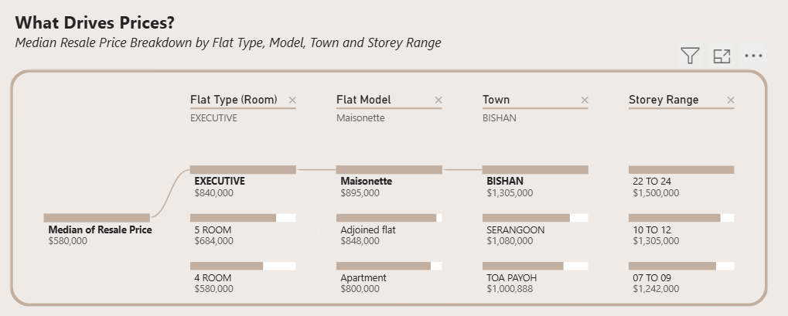
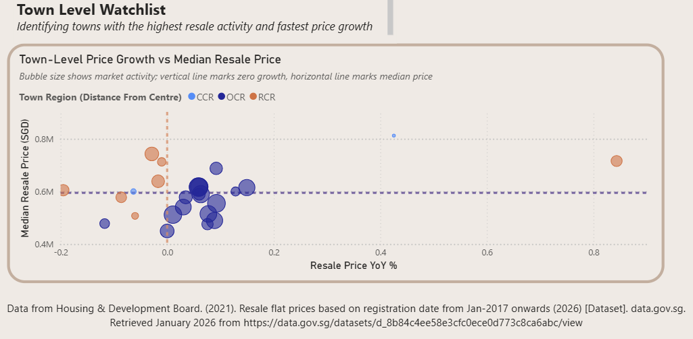

# HDB Resale Market Dashboard (2017-2025 Singapore)
An interactive Power BI dashboard analysing HDB resale prices and transaction activity using HDB government data.  
The project combines data wrangling, statistical modelling, and visual analytics to communicate housing market dynamics clearly to non-technical audiences.

---

## Dashboard Overview

## Key Visuals
### Resale Price & Transaction Snapshot and Long-Term Trend

### Key Price Drivers

### Town-Level Watchlist

---

## Key Insights

### 1. Overall HDB Resale Price Trend

**Summary**  
HDB resale prices surged sharply in 2021 following COVID-related supply disruptions, and while cooling measures have stabilised growth since 2022, prices remain structurally higher than pre-COVID levels, likely reflecting inflationary pressures and sustained housing demand.

**Supporting observations**
- From **2018–2020**, annual price growth ranged between **−4.8% (2019)** and **+2.5%**, indicating a relatively subdued market.
- In **2021**, prices increased by approximately **15% year-on-year**, coinciding with BTO construction delays due to COVID circuit breaker measures and demand outstrips supply. 
- Growth decreases to at **8.7% in 2022** following the introduction of cooling measures.
- From **2023 onwards**, growth stabilised within a **6–7.5% range**, lower than peak levels but consistently above pre-COVID trends.

---

### 2. Market Structure by Town Region

**Summary**  
Core Central Region (CCR) flats exhibit premium-market characteristics—higher prices, lower transaction volumes, and greater volatility—and decreasing transaction activity, while RCR (rest of central region) and OCR (outside central region) demonstrate steadier growth and increasing activity, suggesting demand is might be absorbed outside the core central areas.

**Supporting observations**
- **CCR** consistently records the **highest median prices** but the **lowest transaction counts**, indicating a niche market.
- Prices in CCR are more volatile, with noticeable dips in **2020** and **2023**, likely reflecting sensitivity to economic conditions.
- **RCR and OCR** show healthier and more stable growth, supported by broader owner-occupier demand.
- The pattern suggests buyers may be trading centrality for affordability, space, or value.

---

### 3. Town-Level Watchlist (Activity vs Growth)

**Summary**  
OCR towns dominate transaction volume, CCR remains a high-price niche, and RCR stands out as the strongest performer by combining both strong price growth and high market activity—particularly in Toa Payoh and Queenstown.

**Supporting observations**
- **OCR estates** (e.g. Tampines) lead in transaction count, likely driven by larger housing stock and flats reaching MOP.
- **CCR towns** cluster around high prices but low transaction volumes.
- **RCR towns** such as **Toa Payoh and Queenstown** exhibit both strong year-on-year price growth and high resale activity.
- Some mature RCR estates (e.g. Bishan, Bukit Merah) show short-term negative growth, suggesting localised cooling or market saturation.

---

## How to Read the Dashboard

### Global Filters
- **Flat Type** and **Town Region** slicers (filters) apply across most visuals.
- These allow users to explore how prices and activity differ by housing type (by rooms) and location.

---

### Price Snapshot (Cards at top)
- Displays **specific median resale price** and **transaction count** for the selected year and month.
- Includes **month-on-month** and **year-on-year** indicators for context at a glance.

---

### Long-Term Price Trend (Line + Column Combo Chart)
- Shows historical price trends over time.
- **Not affected by year/month slicers**, allowing users to observe long-term trends.
- Can be explored by flat type or town region using global filters.

---

### Decomposition Tree: Key Drivers of Resale Prices
- Breaks down median resale prices by factors such as:
  - Flat type
  - Flat Model
  - Town
  - Storey range
- Enables users to see which categories contribute most to higher or lower prices.

---

### Town-Level Watchlist (Scatter Plot)
- Compares towns by:
  - **Median resale price**
  - **Year-on-year price growth**
  - **Transaction volume** (marker size)
- Reference lines indicate:
  - **Zero growth** (to quickly identify rising vs declining towns)
  - **Median price benchmark** (to identify above- and below-average markets)
- Towns in the **top-right** and **bottom-left** corners exhibit strongest/weakest performance and warrant closer monitoring.

---

## Explore Yourself

You can download the `.pbix` file to explore the dashboard interactively in **Power BI Desktop**:

[Download HDB Resale Dashboard (.pbix)](HDB_Resale_Dashboard.pbix)

---

## Data & Methodology Notes
- Data is sourced from publicly available **HDB resale transaction records** published by the Housing & Development Board via data.gov.sg.  
  *Housing & Development Board (2021).* *Resale flat prices based on registration date from Jan 2017 onwards* (updated to 2026).
- Resale prices are summarised using **median values** to reduce the influence of extreme transactions and better reflect typical market conditions.
- A **separate regression analysis** was conducted to identify and validate key drivers of HDB resale prices.  
  Insights from this modelling exercise informed the selection of explanatory factors displayed in the dashboard (e.g. flat type, town, storey range, remaining lease).  
  👉 Related project: [HDB Resale Price Regression Modelling](https://github.com/nadia2004/hdb-resale-regression-modelling)

---

## Tools Used
- **Power BI** – dashboarding and visual analytics  
- **R / Python** – data cleaning, transformation, and statistical modelling  
- **GitHub** – version control and portfolio presentation

